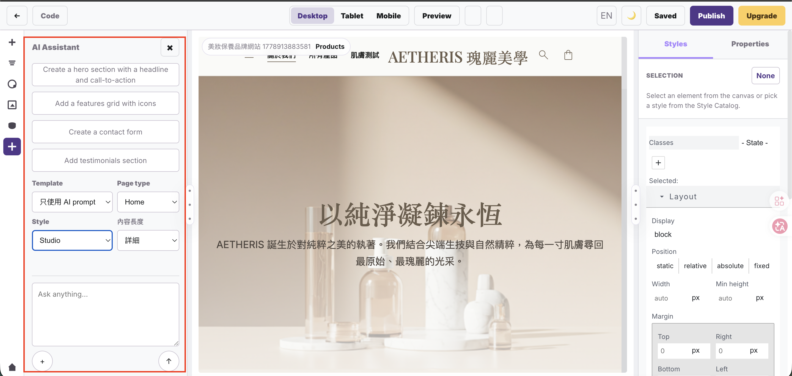

# SiteForge AI Assistant 使用手冊

適用位置：編輯器左側 `AI Assistant` 面板  
適用版本：`frontend/siteforge-ui/src/views/EditorView.vue` 目前實作



## 1. 功能定位

AI Assistant 是「在目前頁面上做區塊級編輯」的工具。它不是整頁重建器。

目前設計原則如下：

- 預設只新增一個 AI 產生的區塊。
- 只有在使用者明確要求「替換、取代、改成、換成、replace」且目前有選取區塊時，才會嘗試替換該區塊。
- 如果 prompt 同時包含「新增、增加、加入、添加、add、insert」等字眼，系統會優先視為新增區塊，不會替換既有內容。
- AI 產生後，畫面會顯示「AI 已用區塊層級套用，未取代整個頁面。」。
- 套用後仍需按上方 `Save` 才會儲存到頁面資料。

## 2. 開啟 AI Assistant

1. 進入任一網站的編輯頁。
2. 點擊最左側垂直工具列的 AI 圖示。
3. 左側面板會切換成 `AI Assistant`。

左側工具列中與 AI 相關的按鈕：

| 按鈕 | 名稱 | 功能 |
|---|---|---|
| AI 圖示 | AI Assistant | 開啟或切換到 AI 助理面板。 |
| `×` | 關閉面板 | 關閉左側 AI Assistant 面板。 |
| 首頁圖示 | Workspace | 回到網站工作區，不是 AI 功能本身，但常用於離開編輯頁。 |

## 3. 快速 Prompt 按鈕

AI 面板上方有四個快捷 prompt。點擊後會把文字放入下方輸入框，方便再微調。

| 按鈕文字 | 用途 |
|---|---|
| `Create a hero section with a headline and call-to-action` | 產生首頁或頁首主視覺區塊。 |
| `Add a features grid with icons` | 新增功能/特色格狀區塊。 |
| `Create a contact form` | 新增聯絡表單區塊。 |
| `Add testimonials section` | 新增客戶評價或推薦語區塊。 |

建議不要直接送出快捷 prompt。先補上品牌、頁面、商品、語言、區塊位置，例如：

```text
在目前產品頁的商品列表後面，新增一個三欄特色區塊，說明 AETHERIS 精華液的保濕、修護、提亮功效，語氣要像高級保養品牌。
```

## 4. Template 選單

`Template` 用來選擇 AI 編輯的起點。

| 選項 | 功能 |
|---|---|
| `只使用 AI prompt` | 不套用預設模板，只依照輸入框的 prompt 產生內容。這是目前最安全的選項。 |
| 其他模板 | 選取後會帶入模板的描述與建議頁型，協助 prompt 起稿。 |

注意：目前 AI 送出時仍以「區塊級編輯」為主，不會因為選了模板就整頁覆蓋。

## 5. Page Type 選單

`Page type` 告訴 AI 這次內容偏向哪一種頁面。它會影響文案語氣、結構與回傳頁面 metadata。

| 選項 | 適合用途 |
|---|---|
| `Home` | 首頁、品牌主視覺、品牌總覽。 |
| `About` | 關於我們、品牌故事、團隊理念。 |
| `Services` | 服務項目、方案介紹。 |
| `Product` | 商品列表、商品介紹、產品特色。 |
| `Portfolio` | 作品集、案例展示。 |
| `Blog` | 文章、專欄、知識內容。 |
| `Contact` | 聯絡資訊、表單、門市資訊。 |
| `anti-counterfeit` | 防偽查驗頁。 |
| `scan-result` | 掃描後的結果頁。 |
| `lottery` | 抽獎活動頁。 |
| `points-redemption` | 點數兌換頁。 |
| `traceability` | 溯源資訊頁。 |
| `dpp` | 數位產品護照頁。 |

範例：

```text
Page type 選 Product，prompt 輸入：
在產品頁下方新增三張保養品情境圖片與短文，圖片區塊要維持 AETHERIS 的乾淨高級感。
```

## 6. Style 選單

`Style` 控制 AI 產生區塊的視覺方向。

| 選項 | 風格說明 |
|---|---|
| `Studio` | 乾淨、留白多、適合品牌形象與高級保養品。 |
| `Tech` | 技術感、數據感、適合 SaaS 或科技產品。 |
| `Premium` | 精品、高單價、強調質感與信任。 |
| `Eco` | 自然、永續、環保素材與柔和文案。 |
| `Fashion` | 時尚、 editorial、適合形象大片與潮流商品。 |

如果是 AETHERIS 這類保養品牌，通常建議先用 `Studio` 或 `Premium`。

## 7. 內容長度選單

`內容長度` 控制 AI 產生文案的密度。

| 選項 | 適合情境 |
|---|---|
| `精簡` | 只要短標題、短說明、簡單卡片。 |
| `中等` | 一般區塊，標題、說明、幾個重點。 |
| `詳細` | 需要完整說明、功用、條列、教育型內容。 |

例如要寫「透明質酸、胜肽複合物、煙酰胺 的說明與功用」，建議選 `詳細`。

## 8. Prompt 輸入框

輸入框是 AI 編輯的主要控制點。請把「內容需求」與「排版需求」都寫清楚。

好的 prompt 應包含：

- 要新增還是替換。
- 要放在哪個區塊附近。
- 要生成什麼內容。
- 要幾個項目或幾欄。
- 語言與品牌語氣。
- 是否要保留原有頁首、導覽、既有排版。

推薦寫法：

```text
在目前區塊後面新增一個三欄成分說明區塊，內容要解釋透明質酸、胜肽複合物、煙酰胺的說明與功用。每個成分要包含中文名稱、英文名稱、2-3 句說明、3 個功效條列。請維持 AETHERIS 高級保養品牌風格，不要取代原本頁面。
```

不建議寫法：

```text
幫我加內容
```

這種 prompt 太短，AI 容易只補版面，內容不夠準。

## 9. `+` 按鈕

`+` 是「加入內容/上下文」的預留入口。

目前狀態：

- UI 已顯示按鈕。
- 目前尚未綁定檔案、資料表或素材選擇邏輯。
- 不會送出 prompt，也不會自動上傳資料。

實務上目前請直接把需要的上下文寫進輸入框。

## 10. `↑` 送出按鈕

`↑` 是送出 prompt 的按鈕。

送出後系統會：

1. 讀取目前頁面的 HTML、CSS、JS。
2. 帶上 `Page type`、`Style`、`內容長度` 與 prompt。
3. 呼叫 `/api/AiConversations/generate-page`。
4. 接收 AI 回傳的 HTML/CSS。
5. 以區塊方式插入或替換，不直接覆蓋整頁。
6. 將新增區塊設為目前選取元素。
7. 將頁面標記為 `Unsaved changes`。

送出後請檢查畫面，再按 `Save`。

## 11. 插入與替換規則

AI Assistant 目前分成兩種行為。

### 新增區塊

當 prompt 包含下列字眼時，系統會視為新增：

```text
增加、新增、添加、加入、補上、加上、add、insert、append、more
```

新增時：

- 如果目前有選取一個內容區塊，AI 會盡量插入在該區塊後面。
- 如果沒有選取區塊，AI 會加入頁面根層。
- 如果選取的是頁首、導覽等頁面 chrome 區域，系統會避免把新增內容塞進該區域。

### 替換區塊

當 prompt 包含下列字眼，且沒有同時要求新增時，系統會視為替換：

```text
替換、取代、替代、改成、換成、覆蓋、replace、rewrite
```

替換時：

- 必須先在畫布上選取一個區塊。
- AI 只替換該選取區塊。
- 不會主動重建整個頁面。

範例：

```text
請把目前選取的特色區塊替換成三欄成分功效卡片，內容包含透明質酸、胜肽複合物、煙酰胺。
```

## 12. 特殊內容：成分說明

系統目前對保養成分 prompt 有特殊處理。只要 prompt 包含下列關鍵字之一：

```text
透明質酸、玻尿酸、hyaluron、胜肽、peptide、煙酰胺、菸鹼醯胺、niacinamide、成分、功用、ingredient
```

如果 AI 回傳內容不足，前端會用內建成分說明區塊補上完整內容。內建內容包含：

- 透明質酸 / Hyaluronic Acid
- 胜肽複合物 / Peptide Complex
- 煙酰胺 / Niacinamide
- 每個成分的說明與功效條列

這是為了避免 AI 只重複標題、沒有內容。

## 13. 產生後如何檢查

AI 套用後請依序檢查：

1. 新區塊是否出現在預期位置。
2. 原本頁首、導覽、既有區塊是否仍保留。
3. 文案是否真的回答 prompt，而不是只重複標題。
4. 排版在 Desktop / Tablet / Mobile 是否正常。
5. 右上角是否顯示 `Save`，如果有就按下儲存。

可用上方工具：

| 按鈕 | 用途 |
|---|---|
| `Desktop` | 檢查桌機版排版。 |
| `Tablet` | 檢查平板寬度。 |
| `Mobile` | 檢查手機寬度。 |
| `Preview` | 預覽頁面。 |
| Undo | 復原剛剛的 AI 插入或替換。 |
| Redo | 重做復原的操作。 |
| `Save` | 儲存 AI 套用後的頁面。 |

## 14. E2E 測試流程

建議每次調整 AI 功能後，用以下流程截圖保存。

1. 啟動服務：

```bash
./stop_service.sh
./start_service.sh
```

2. 開啟：

```text
http://127.0.0.1:5010
```

3. 進入任一網站的編輯頁。
4. 點擊左側 AI Assistant。
5. 選擇：

```text
Template: 只使用 AI prompt
Page type: Product
Style: Studio
內容長度: 詳細
```

6. 輸入測試 prompt：

```text
在目前區塊後面新增一個三欄成分說明區塊，內容要解釋透明質酸、胜肽複合物、煙酰胺的說明與功用。每個成分要包含中文名稱、英文名稱、2-3 句說明、3 個功效條列。不要取代原本頁面。
```

7. 按 `↑`。
8. 截圖記錄 AI 面板與生成後畫面。
9. 檢查是否只新增區塊，沒有整頁重建。
10. 按 `Save`。

本手冊目前使用的 E2E/畫面截圖位於：

```text
docs/manual/images/ai-assistant-overview.png
```

## 15. 常見問題

### AI 只產生標題，沒有內容

把 prompt 寫成「內容需求 + 結構需求」。例如要求每個成分要有說明、功效條列、英文名稱。

### AI 把區塊放錯位置

先在畫布中點選目標區塊，再送出 prompt。新增會盡量插入在選取區塊後面。

### 我想替換一個區塊

先選取該區塊，prompt 明確寫「替換目前選取區塊」。不要同時寫「新增」。

### 我怕破壞原頁面

使用「新增」語氣，並在 prompt 加上：

```text
不要取代原本頁面，請只新增一個區塊。
```

### 送出後結果不滿意

先按 Undo 復原，再調整 prompt。不要直接連續送很多次，否則會堆出多個不需要的區塊。

### 送出後出現 API 錯誤

檢查：

- API 是否在 `8000`。
- UI 是否在 `5010`。
- `artifacts/service/api.log` 是否有錯誤。
- PostgreSQL 是否啟動。

## 16. 最佳 Prompt 模板

### 新增內容區塊

```text
在目前選取區塊後面新增一個[欄數/版型]區塊，主題是[內容主題]。
請包含[需要的內容項目]。
語氣要符合[品牌/產業]。
不要取代原本頁面，只新增一個區塊。
```

### 替換目前選取區塊

```text
請替換目前選取區塊，改成[新區塊版型]。
內容包含[項目一]、[項目二]、[項目三]。
請保留整體網站風格，不要修改其他區塊。
```

### 產品圖片區塊

```text
在產品頁商品介紹後面新增一個產品圖片展示區塊，包含 6 張保養品情境圖片與短標題。請使用高級保養品牌風格，不要取代目前頁面。
```

### 成分說明區塊

```text
在目前區塊後面新增一個三欄成分說明區塊，內容要解釋透明質酸、胜肽複合物、煙酰胺的說明與功用。每個成分要包含中文名稱、英文名稱、2-3 句說明、3 個功效條列。請維持 AETHERIS 高級保養品牌風格，不要取代原本頁面。
```

