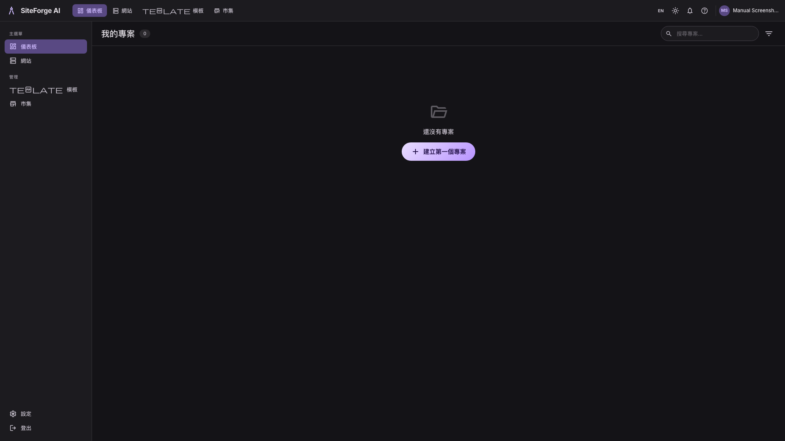
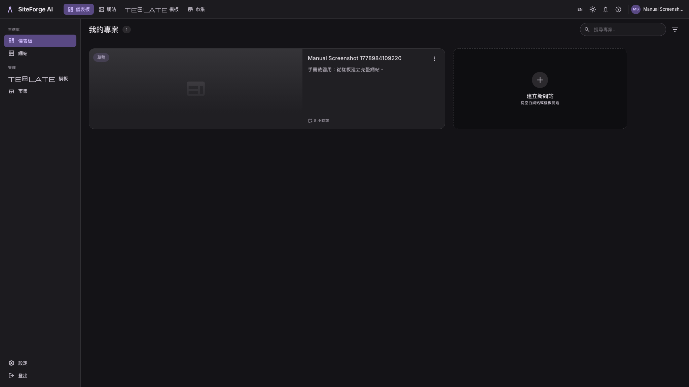
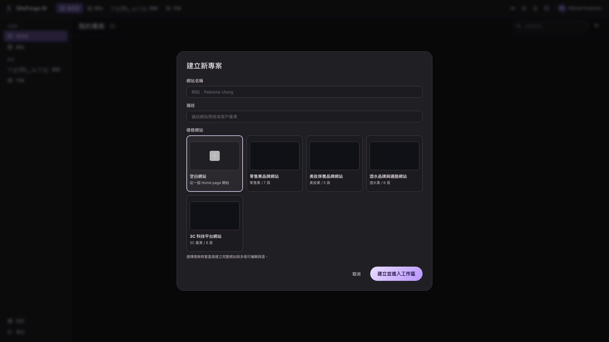
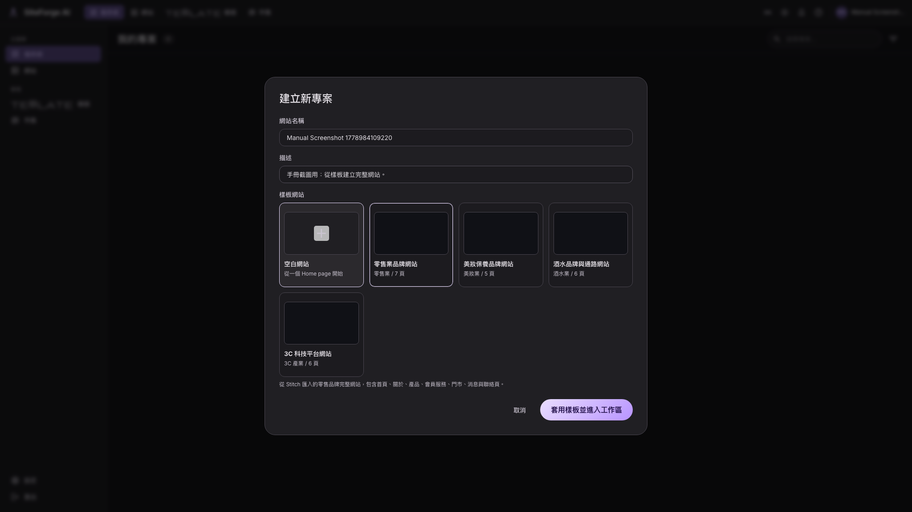

# Dashboard 與專案管理使用手冊

適用位置：登入後的首頁 `/`  
驗證方式：E2E 註冊、Dashboard 空狀態、建立專案視窗、刪除專案腳本



## 1. Dashboard 功能定位

Dashboard 是所有網站專案的入口。你可以在這裡：

- 查看目前帳號下的網站專案。
- 搜尋專案。
- 建立新網站。
- 從樣板建立完整網站。
- 開啟既有網站的 Workspace。
- 刪除不需要的專案。

## 2. 專案列表

每個專案卡片會顯示：

| 欄位 | 說明 |
|---|---|
| 專案名稱 | 建立網站時輸入的名稱。 |
| 描述 | 建立網站時輸入的用途或產業描述。 |
| 狀態 | `Draft` 或 `Published`。目前 Dashboard 上的狀態徽章主要作為顯示用途。 |
| 更新時間 | 依最近更新時間顯示。 |
| 頁面數 | 有些卡片會顯示網站頁面數。 |

點擊專案卡片本體會進入該網站的 Workspace。



## 3. 搜尋專案

Dashboard 上方搜尋框可用專案名稱過濾列表。

使用方式：

1. 點擊搜尋框。
2. 輸入專案名稱的一部分。
3. 列表會即時只顯示符合的專案。

目前搜尋只比對專案名稱，不會搜尋描述、頁面內容或發佈網址。

## 4. 建立空白網站

1. 點 `Create your first project`、`Create New Site`、`New Project` 或 `建立第一個專案`。
2. 在 `網站名稱` 輸入名稱。
3. 在 `描述` 輸入用途或客戶產業。
4. 在樣板區選 `空白網站`。
5. 按 `建立並進入工作區`。



空白網站會建立一個基礎 Home page，適合從 Editor 手動拖曳區塊開始。

## 5. 從樣板建立網站



1. 開啟建立專案視窗。
2. 填入網站名稱與描述。
3. 選擇一個 `樣板網站`。
4. 按 `套用樣板並進入工作區`。

樣板網站會一次產生多個頁面。例如美妝、零售、飲品、3C 類型會包含首頁、商品、服務、關於、聯絡等頁面。

建議描述寫得具體一點，例如：

```text
高級保養品牌，主打修護精華、透明質酸與胜肽配方，語氣要乾淨、專業、有精品感。
```

## 6. 刪除專案

專案卡片右上角的更多選單可刪除專案。

刪除流程：

1. 找到要刪除的專案。
2. 點卡片右上角 `more_vert`。
3. 點 `刪除專案` 或 `Delete project`。
4. 系統會跳出確認視窗。
5. 確認後會移除網站、頁面與已發佈檔案。

注意：刪除是破壞性操作，刪除後手冊流程中沒有提供 UI 復原入口。

## 7. 語言、主題與帳號

Dashboard 外層導覽列或側欄可操作：

| 控制 | 說明 |
|---|---|
| 語言切換 | 在 English 與繁中之間切換。 |
| 主題切換 | 在深色與亮色模式之間切換。 |
| 使用者區塊 | 顯示目前登入使用者。 |
| Logout | 登出並回到登入狀態。 |

目前部分 Workspace / Editor 文案仍是英文，這是目前實作狀態。
