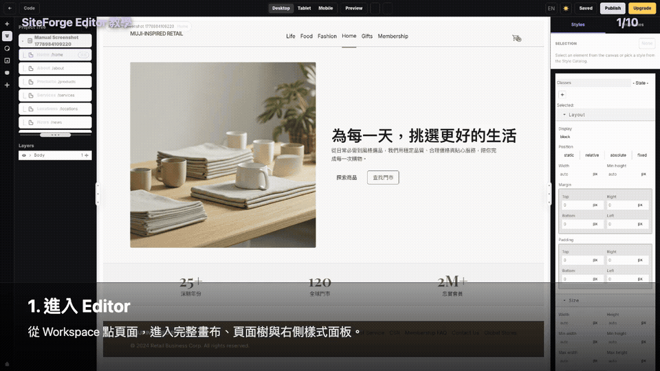
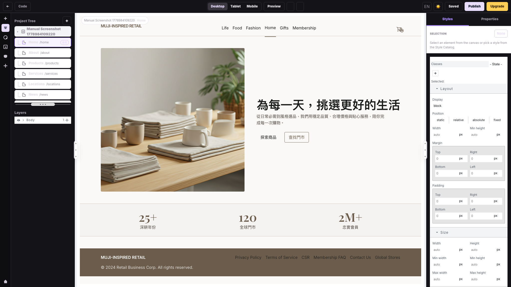
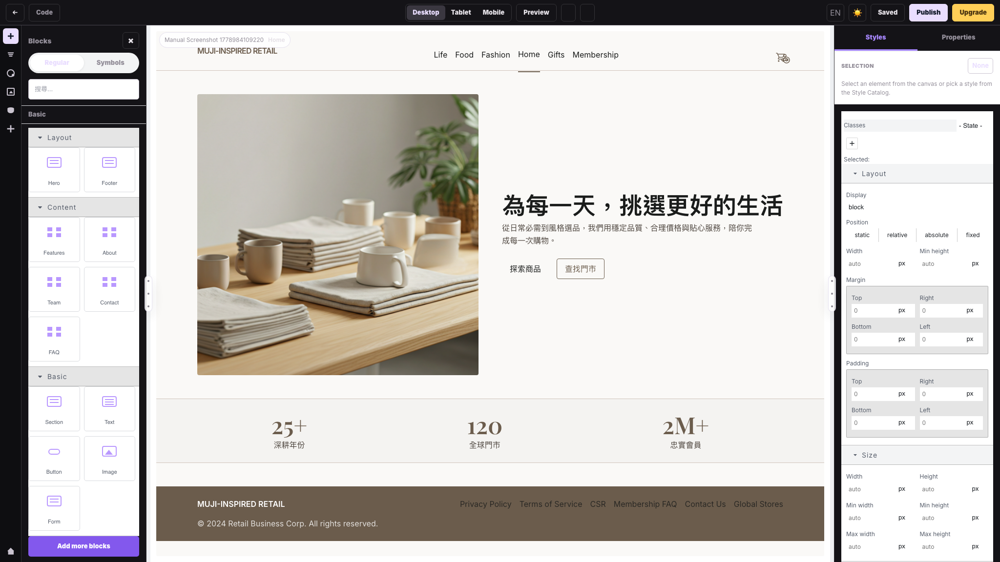
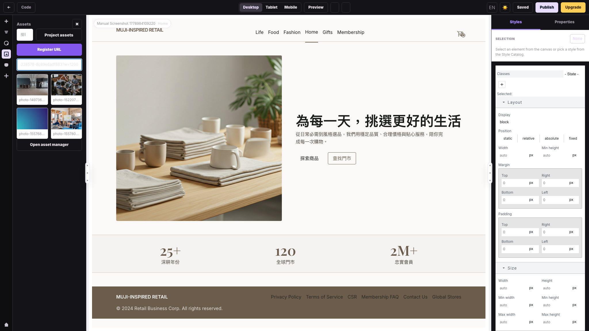
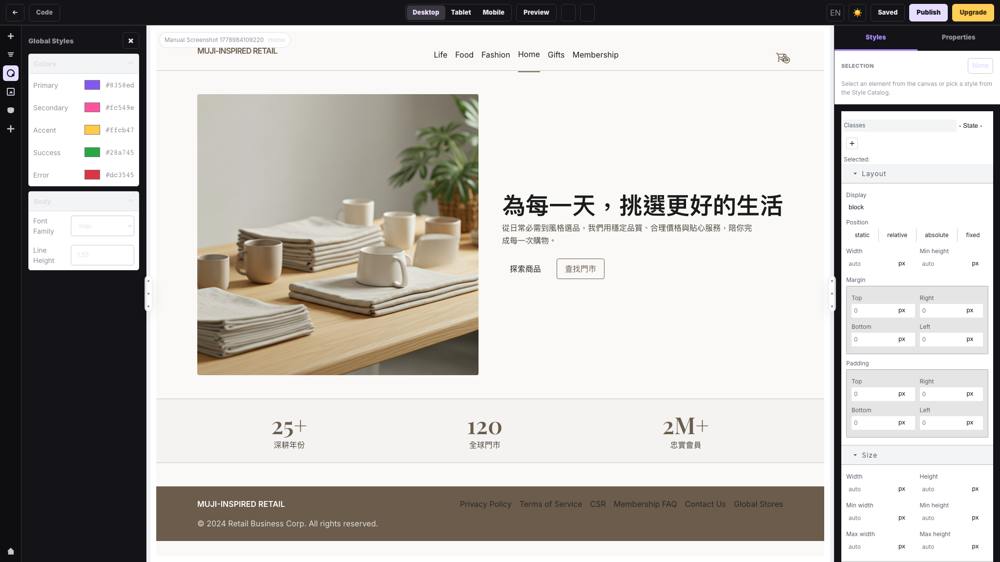
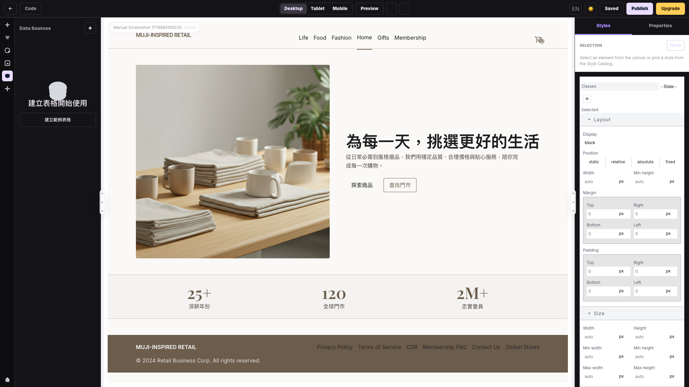
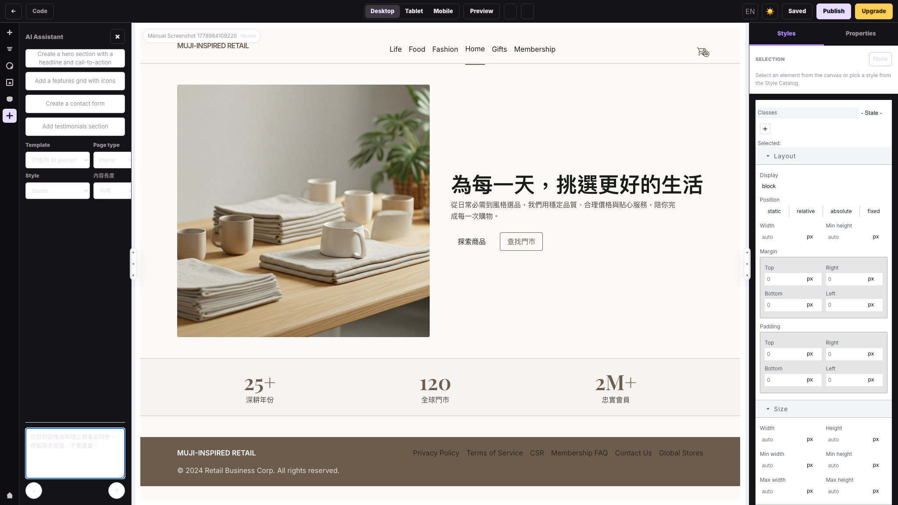
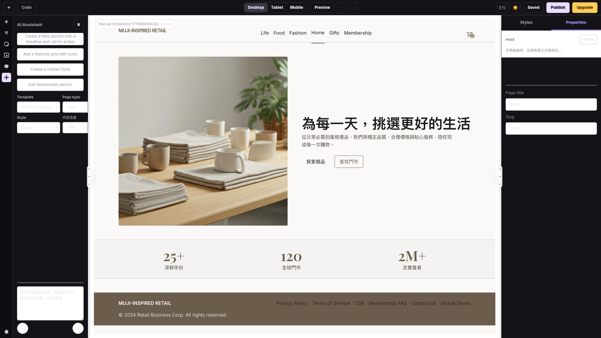
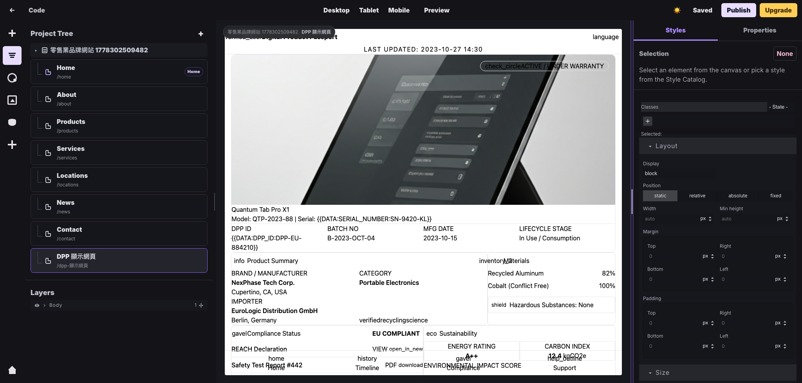
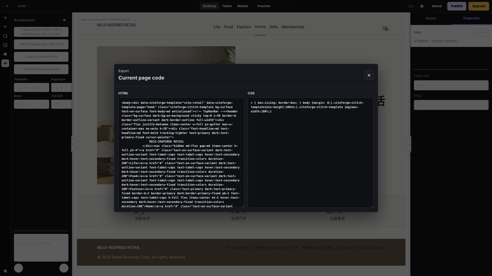

# SiteForge Editor 使用手冊

適用位置：`/editor/:siteId/:pageId`  
驗證方式：E2E 開啟 Editor、GrapesJS 畫布載入、左右面板 resize、頁面樹與 DPP 模板頁截圖

## 動態教學

下面這支 GIF 會用 10 個畫面快速示範：進入 Editor、拖曳區塊、調整樣式、管理素材、使用 AI Assistant、檢查 Properties / Code，以及切換 Tablet / Mobile。

影片檔版本：

[SiteForge Editor 教學 MP4](./media/siteforge-editor-tutorial.mp4)

下面這支是實作型教學：在 Editor 內拖拉 `Section`、`Image`、`Text`、`Button` 等 blocks，完成一個沙發產品介紹頁，最後切換 Desktop / Tablet / Mobile 檢查版面。每一步的 block、落點與參數請看 [沙發產品頁拖拉實作教學](./SOFA_PRODUCT_PAGE_TUTORIAL.md)。

影片檔版本：

[沙發產品頁拖拉實作 MP4](./media/siteforge-sofa-editor-demo.mp4)

## 1. Editor 功能定位

Editor 是 SiteForge 的主要頁面編輯器。它以 GrapesJS 為畫布核心，外層提供 SiteForge 專用的頁面樹、區塊、素材、全域樣式、資料來源、AI Assistant、右側樣式與屬性面板。

在 Editor 裡完成的修改，必須按 `Save` 才會寫回頁面資料。

## 2. 上方工具列

| 控制 | 功能 |
|---|---|
| `←` | 回到 Workspace。若有未儲存變更，會出現確認。 |
| `Code` | 開啟目前頁面的 HTML / CSS 檢視。 |
| `Desktop` | 切換桌機畫布寬度。 |
| `Tablet` | 切換平板畫布寬度。 |
| `Mobile` | 切換手機畫布寬度。 |
| `Preview` | 切換預覽模式。 |
| Undo / Redo | 復原或重做 GrapesJS 操作。 |
| 語言切換 | 切換 English / 繁中。 |
| 主題切換 | 切換深色 / 亮色 UI。 |
| `Save` | 儲存目前頁面。 |
| `Publish` | 發佈整個網站。 |
| `Upgrade` | 目前為方案入口按鈕。 |

## 3. 左側 Rail 與面板

左側垂直 rail 可切換不同工作面板。

| 圖示 / 面板 | 用途 |
|---|---|
| Blocks | 拖曳基本區塊到畫布。 |
| Pages / Project Tree | 查看網站頁面，切換目前編輯頁。 |
| Global Styles | 調整全域色票、字體與行高。 |
| Assets | 管理或選擇圖片 URL。 |
| Data Sources | 建立範例資料表，目前偏向展示/雛形功能。 |
| AI Assistant | 用 prompt 新增或替換區塊。 |
| Workspace | 返回網站 Workspace。 |

## 4. Project Tree 與 Layers

`Project Tree` 顯示目前網站與所有頁面。點擊任一頁面會切換 Editor 到該頁。

`Layers` 顯示目前畫布內的元素層級，適合選取深層區塊或確認結構。

Project Tree 與 Layers 中間的水平 resizer 可調整兩者高度。

## 5. Blocks 面板

Blocks 面板目前包含基本區塊：

| 區塊 | 用途 |
|---|---|
| Section | 新增一般 section。 |
| Text | 新增段落文字。 |
| Button | 新增行動按鈕。 |
| Image | 新增圖片。 |
| Form | 新增簡單表單。 |

Editor 也已接入 `grapesjs-tailwind`，Blocks 內會出現 Tailwind / Tailblocks 類型的分類，例如 Hero、Features、CTA、Pricing、Gallery、Testimonials、Team、Contact、Footer，以及 `grapesjs-plugin-forms` 提供的表單欄位 blocks。

使用方式：

1. 打開 `Blocks`。
2. 將區塊拖曳到畫布。
3. 在畫布或右側面板調整內容與樣式。
4. 按 `Save`。

## 6. Assets 面板

Assets 面板可用於處理圖片素材。

目前可用功能：

- 搜尋資產。
- 輸入圖片 URL 並按 `Register URL`。
- 點選預設或已註冊素材。
- 在右側 Properties 中替換選取圖片的 URL 與 alt text。

注意：目前手冊驗證的是 URL 型素材流程；本機檔案上傳是否完整可用需依後端 Assets API 狀態確認。

## 7. Global Styles

Global Styles 可調整：

- Primary / Secondary / Accent / Success / Error 色票。
- Body font family。
- Body line height。

變更會套用到目前頁面畫布，但仍需按 `Save` 才能保存。

## 8. Data Sources 面板

Data Sources 目前提供範例資料表入口，適合用來確認未來資料綁定的 UI 位置。

## 9. AI Assistant 面板

AI Assistant 可在目前頁面新增或替換區塊。完整操作細節請看 [AI Assistant 使用手冊](./AI_ASSISTANT_MANUAL.md)。

## 10. 右側 Styles / Properties

右側面板有兩個分頁：

| 分頁 | 用途 |
|---|---|
| Styles | 查看目前選取元素並調整 GrapesJS style sectors。 |
| Properties | 查看頁面資訊，或在選取圖片時編輯圖片 URL、alt text。 |

如果沒有選取元素，Styles 會顯示 `None` 與提示文字。

## 11. 面板寬度調整

Editor 支援調整：

- 左面板與畫布寬度。
- 畫布與右面板寬度。
- Project Tree 與 Layers 高度。

E2E 已驗證左右 resizer 可拖曳，並能改變面板尺寸。

## 12. Code 視窗

點 `Code` 可查看目前頁面的 HTML 與 CSS。

用途：

- 檢查 AI 或 GrapesJS 產生的頁面碼。
- 快速確認樣式是否套用。
- 除錯發佈後的畫面差異。

目前 Code 視窗是唯讀檢視，不是原始碼編輯器。

## 13. 裝置寬度檢查

上方 `Desktop`、`Tablet`、`Mobile` 可切換畫布寬度，發佈前建議三種都檢查。

## 14. 儲存與離開

當畫面出現 `Unsaved changes` 時，表示目前頁面有變更尚未儲存。

建議流程：

1. 完成拖曳、樣式、AI 編輯或圖片替換。
2. 檢查 Desktop / Tablet / Mobile。
3. 按 `Save`。
4. 看到 `Saved` 或成功提示後，再切頁或返回 Workspace。

如果未儲存就返回 Workspace 或切換頁面，系統會跳出確認。
