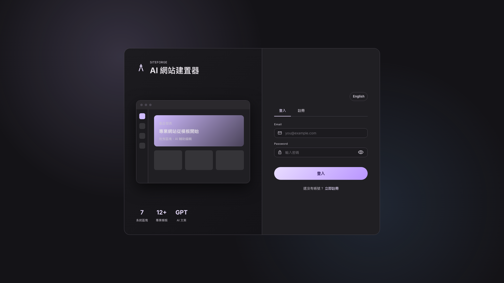
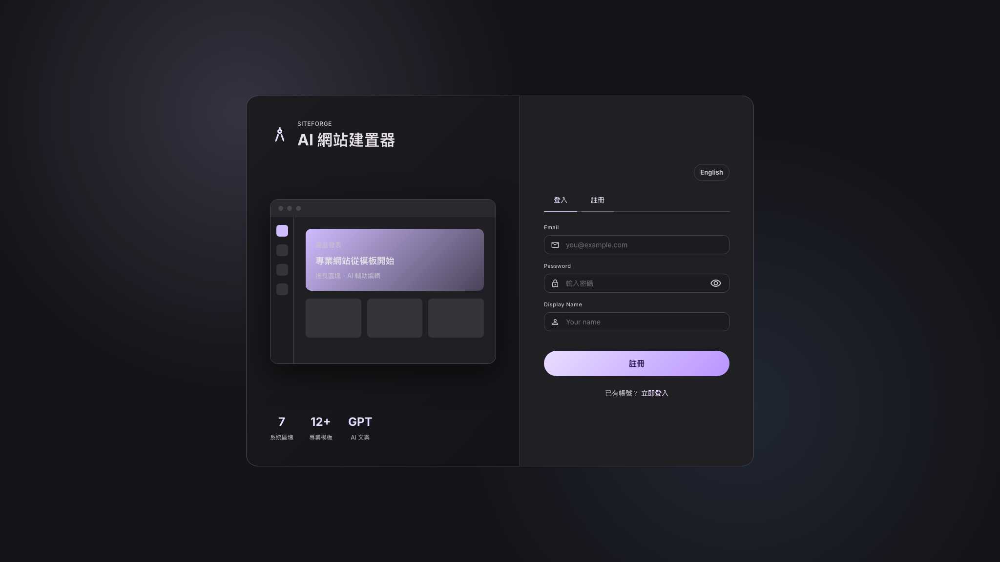
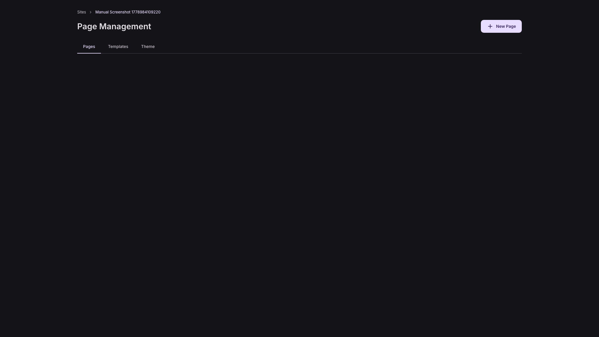

# SiteForge 快速開始

適用對象：第一次使用 SiteForge 的使用者  
驗證方式：E2E 登入與建站流程、UI 截圖、前端路由與 API 行為



## 1. 啟動服務

在專案根目錄啟動 UI 與 API：

```bash
./start_service.sh
```

預設服務位置：

| 服務 | 預設網址 |
|---|---|
| SiteForge UI | `http://127.0.0.1:5010` |
| SiteForge API | `http://127.0.0.1:8000` |
| Swagger | `http://127.0.0.1:8000/swagger` |

如果需要停止服務：

```bash
./stop_service.sh
```

## 2. 註冊或登入

1. 開啟 `http://127.0.0.1:5010/login`。
2. 如已有帳號，停留在 `登入` 分頁。
3. 如需新帳號，切到 `註冊` 分頁。
4. 輸入 Email、Password，註冊模式另可輸入 Display Name。
5. 送出後會進入 Dashboard。

登入頁右上角可切換語言；密碼欄右側眼睛圖示可顯示或隱藏密碼。



## 3. 建立第一個網站


Dashboard 空狀態會顯示 `Create your first project` 或 `建立第一個專案`。點擊後會開啟建立專案視窗。

建立網站有兩種方式：

| 方式 | 適合情境 |
|---|---|
| 空白網站 | 想從單一 Home page 開始，自行拖曳區塊。 |
| 樣板網站 | 想一次產生完整網站與多個頁面，再逐頁修改。 |

建議第一次使用時先選樣板網站，因為能最快看到 SiteForge 的完整流程。

## 4. 套用網站樣板


1. 在建立專案視窗填入 `網站名稱`。
2. 可選填 `描述`，描述會作為 AI/樣板生成的上下文。
3. 在 `樣板網站` 中選擇產業樣板，例如零售、美妝、飲品、3C 等。
4. 按 `套用樣板並進入工作區`。


套用樣板後，系統會建立網站與多個頁面，並導向 Workspace。

## 5. 編輯與發佈

進入 Workspace 後：

1. 點任一頁面卡片進入 Editor。
2. 在 Editor 中拖曳區塊、修改文字、調整樣式或使用 AI Assistant。
3. 按 `Save` 儲存目前頁面。
4. 按 `Publish` 發佈整個網站。
5. 回到公開預覽網址檢查結果。




注意：AI Assistant 套用後只會標記為 `Unsaved changes`，仍需手動按 `Save`。

## 6. 常見啟動問題

### UI 打不開

檢查 `artifacts/service/ui.log`，確認 Vite 是否已啟動在 `5010`。

### API 打不開

檢查：

- PostgreSQL 是否啟動。
- `artifacts/service/api.log` 是否有資料庫連線錯誤。
- `backend/SiteForge/SiteForge.Api/appsettings.json` 的連線字串是否正確。

### 註冊或建立網站失敗

通常是 API 或資料庫未正常啟動。先開 Swagger 或看 API log，再重試 UI。
