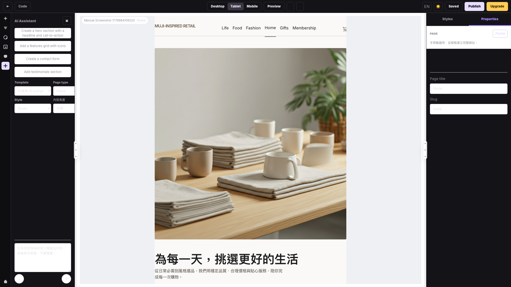
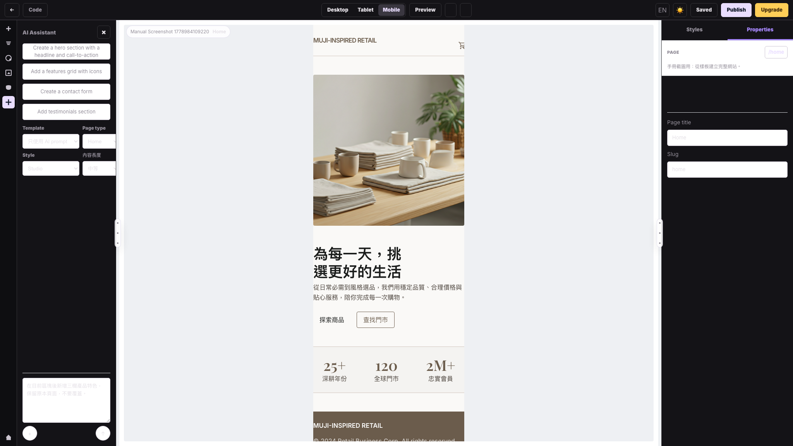

# 發佈、公開預覽與 E2E 驗證

適用範圍：儲存頁面、發佈網站、公開靜態頁、E2E 驗證流程  
驗證日期：2026-05-17（Asia/Taipei 環境）

## 1. 發佈前檢查

發佈前建議先在 Editor 完成：

1. 按 `Save` 儲存目前頁面。
2. 切換 `Desktop`、`Tablet`、`Mobile` 檢查排版。
3. 用 `Preview` 檢查互動與大致外觀。
4. 回到其他頁面檢查是否也需要更新。
5. 確認要公開的頁面狀態。

注意：`Publish` 會發佈整個網站，不只是目前頁面。





## 2. 從 Editor 發佈

1. 在 Editor 右上角點 `Publish`。
2. 等待按鈕狀態從 `Publishing` 回復。
3. 成功時會出現 `網站已發佈。` 或對應成功訊息。
4. 到公開網址檢查輸出結果。

發佈後，後端會產生靜態 HTML 檔案到 API 的 `wwwroot` 發佈目錄。

## 3. 從 API 驗證發佈狀態

E2E smoke 腳本會用 API 驗證：

- 建立使用者。
- 建立網站。
- 更新頁面 HTML / CSS / JS。
- 建立第二頁。
- 呼叫 `/api/Sites/{siteId}/publish`。
- 確認網站狀態變成 `published`。
- 讀取公開 HTML，確認內容真的存在。

對應腳本：

```text
scripts/e2e-smoke.sh
```

## 4. UI E2E 驗證流程

主要 UI E2E 腳本：

```text
scripts/e2e-ui-template-flow.mjs
```

此腳本覆蓋：

| 步驟 | 驗證內容 |
|---|---|
| 開啟登入頁 | `/login` 可載入並截圖。 |
| 註冊使用者 | 透過 UI 建立新帳號。 |
| Dashboard | 確認空狀態或建立入口。 |
| 建立樣板網站 | 檢查網站樣板縮圖與選擇流程。 |
| Workspace | 確認樣板網站產生多個頁面。 |
| Workspace 分頁 | 驗證 Pages、Templates、Theme 與頁面更多選單。 |
| Editor | 確認 GrapesJS frame、頁面樹、畫布可見。 |
| Editor 面板 | 驗證 Blocks、Global Styles、Assets、AI Assistant 面板可開啟。 |
| 面板 resize | 拖曳左、右面板 resizer 並確認尺寸改變。 |

E2E artifacts 會輸出到：

```text
artifacts/e2e-ui/
```

本手冊收錄的圖片已複製到：

```text
docs/manual/images/
```

本次另外用手冊截圖腳本補抓了 21 張畫面，輸出檔名為 `manual-01-*` 到 `manual-21-*`。

## 5. 本輪驗證結果

本輪執行結果：

| 指令 | 結果 | 備註 |
|---|---|---|
| `rtk zsh scripts/e2e-smoke.sh` | 通過 | 預設模式會啟動臨時 API `127.0.0.1:5068`，已通過 15 checks。 |
| `rtk env SITEFORGE_E2E_BASE_URL=http://127.0.0.1:8000 zsh scripts/e2e-smoke.sh` | 通過 | 對既有 `8000` API 執行 smoke，已通過 15 checks。 |
| `rtk node scripts/e2e-ui-template-flow.mjs` | 通過 | 已通過註冊、建站、Workspace 分頁、頁面選單、Editor 面板與 resizer 驗證。 |
| `rtk node /private/tmp/siteforge-manual-screenshots.mjs` | 通過 | 補抓 21 張手冊截圖，涵蓋 Login、Dashboard、Workspace、Editor 面板、Code 視窗與裝置切換。 |

如果在 Codex sandbox 內直接連本機 `127.0.0.1` 失敗，需用允許本機網路的執行方式重跑；這是執行環境限制，不是 SiteForge API 本身失敗。

## 6. 已修正的 E2E 問題

### Dashboard 與 Workspace selector 過期

原本 `scripts/e2e-ui-template-flow.mjs` 在註冊後等待固定文字：

```text
/No projects yet|Create your first project|Create New Site/
```

後續又期待舊版 Workspace DOM，例如 `.page-row` 與 `AI 產生頁面`。目前已改成等待實際穩定結構：

- `.sf-dashboard`
- `.sf-dash-empty`
- `.sf-workspace`
- `.sf-ws-card`
- `.sf-ws-menu`
- `.studio-editor`

現在 UI E2E 會依目前產品流程驗證：註冊、建立樣板網站、Workspace 分頁、頁面選單 Edit、Editor 面板與左右 resizer。

### API smoke 健康檢查與診斷不足

`scripts/e2e-smoke.sh` 原本只等 `/swagger/v1/swagger.json`，且 API 提早退出時不會立刻回報。現在已修正：

- 健康檢查支援 `/swagger/v1/swagger.json` 與 `/api/WidgetTemplates`。
- 如果臨時 API 程序提早退出，會立即印出 log tail。
- 支援 `SITEFORGE_E2E_BASE_URL`，可對既有 API 服務跑 smoke。
- AI 生成結果改驗證 site/page id、頁數與 HTML 非空，不再綁定 AI 回傳的特定 class 或文案。

## 7. 手動驗證清單

正式交付前，建議人工再跑一次：

1. 註冊新帳號。
2. 從樣板建立網站。
3. 進 Workspace 確認頁面數。
4. 新增一頁一般頁面。
5. 用 AI 產生一頁 DPP 或防偽頁。
6. 進 Editor 拖一個 Section。
7. 用 AI Assistant 新增一個成分說明區塊。
8. 按 Save。
9. 按 Publish。
10. 開公開頁確認內容與樣式。
