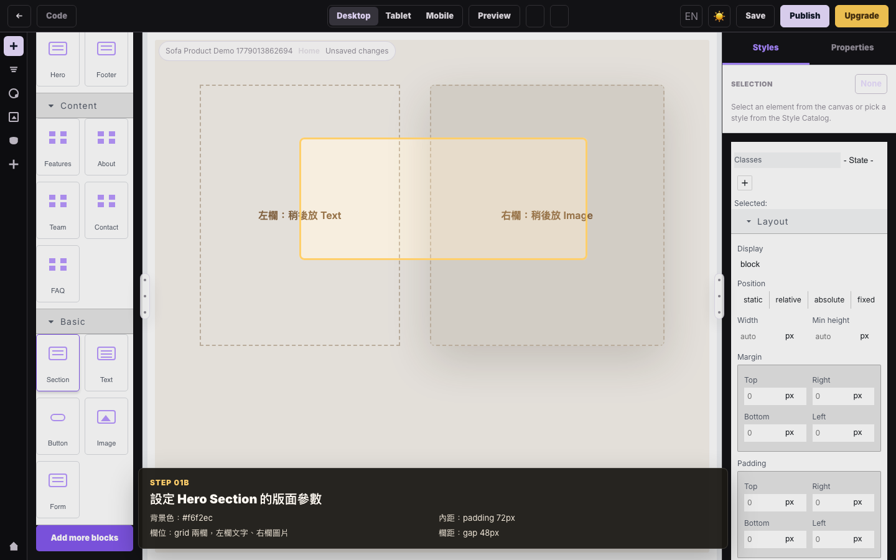
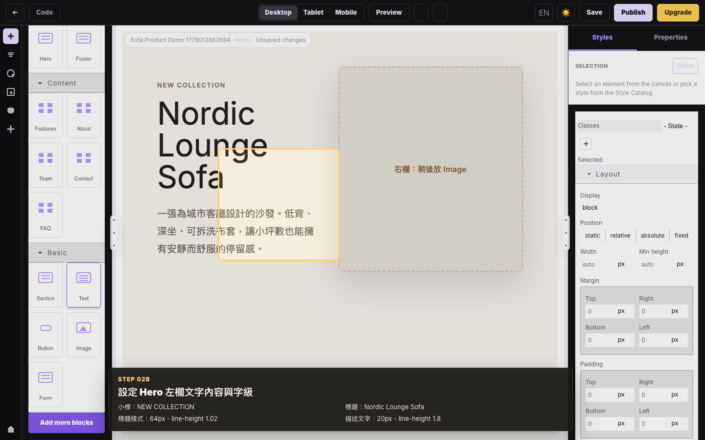
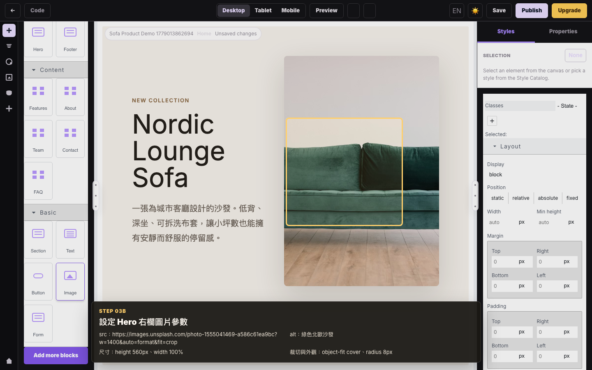
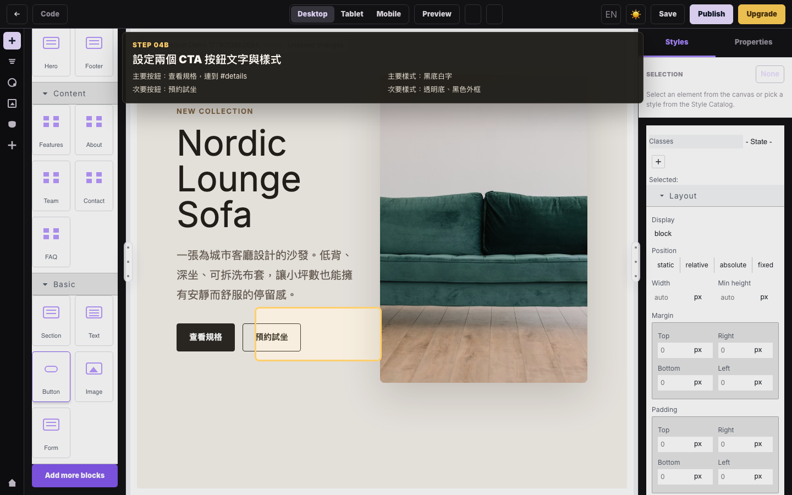
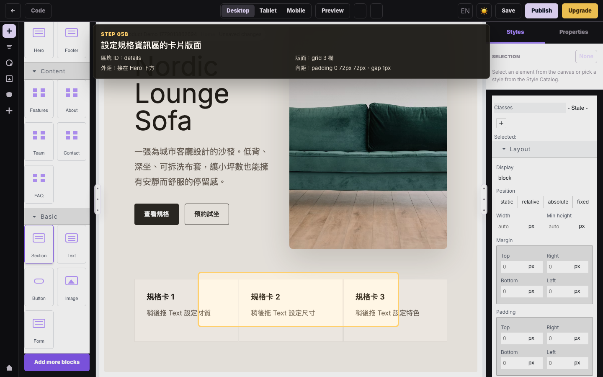
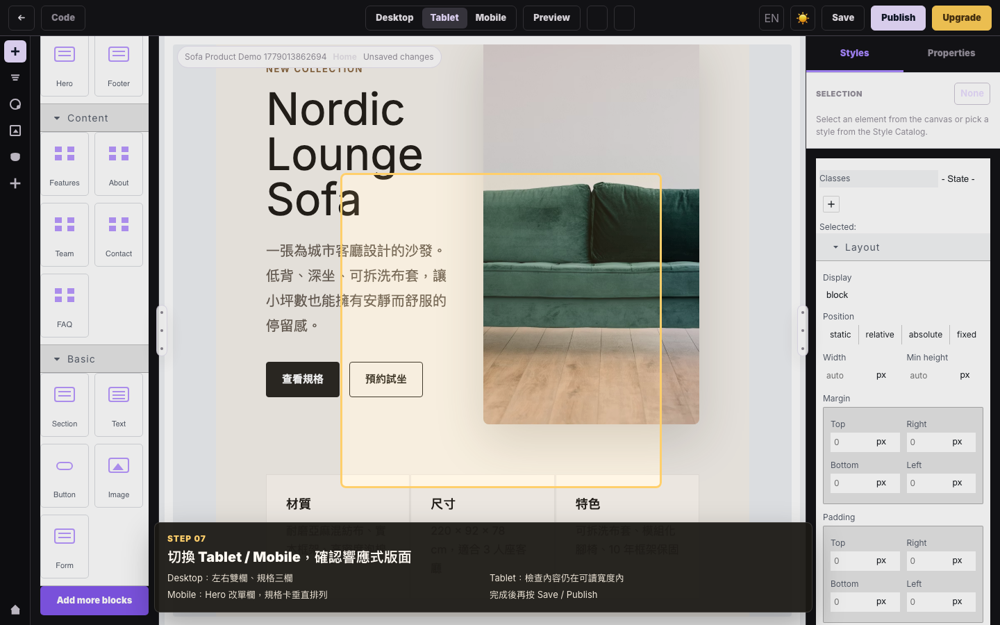
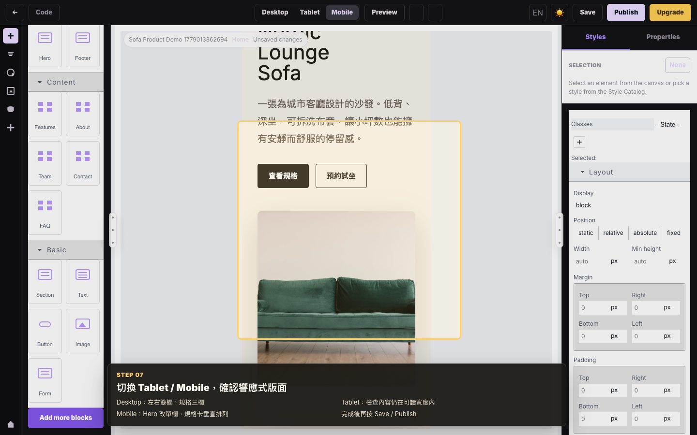
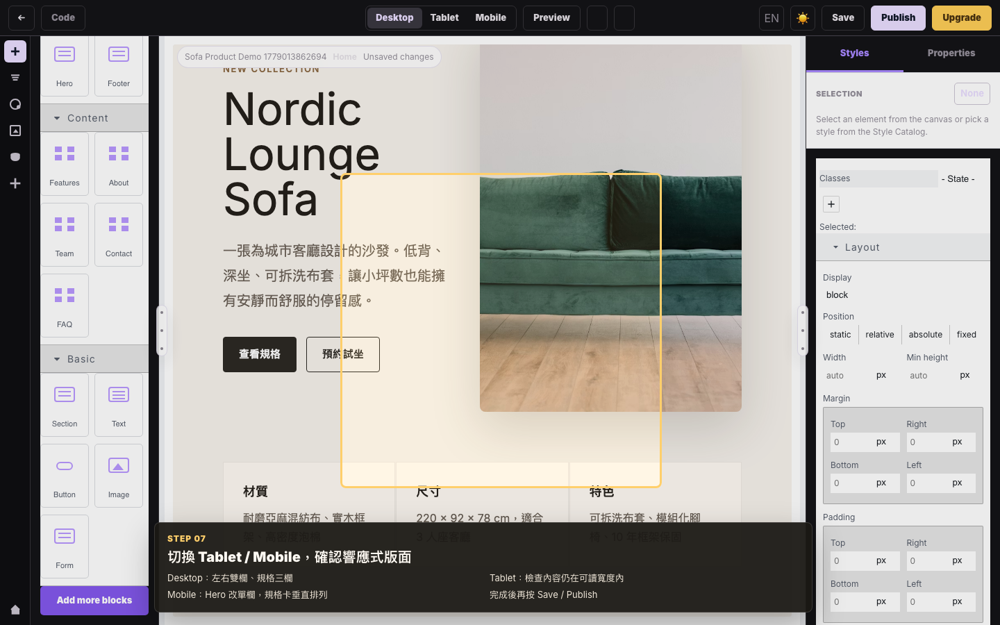

# 沙發產品頁拖拉實作教學

這份教學示範如何在 SiteForge Editor 內，用 blocks 做出一個沙發產品介紹頁。影片與截圖由 E2E 錄製產生，採慢速課程節奏，重點是忠實呈現「拖了什麼、放到哪裡、設定了什麼」。

## 動態教學


影片檔版本：

[沙發產品頁拖拉實作 MP4](./media/siteforge-sofa-editor-demo.mp4)

## 完成頁面結構

```text
Hero Section
  左欄：Text
    NEW COLLECTION
    Nordic Lounge Sofa
    商品描述
    Button：查看規格
    Button：預約試坐
  右欄：Image
    沙發照片

Details Section
  Text：材質
  Text：尺寸
  Text：特色
```

## 步驟 1：拖 Section 建立 Hero 外框

| 項目 | 設定 |
|---|---|
| Block | `Section` |
| 放置位置 | 畫布上半部 |
| 用途 | 產品頁主視覺 Hero |
| 版面 | 左右兩欄 |
| 樣式 | 背景 `#f6f2ec`、padding `72px`、gap `48px` |



## 步驟 2：拖 Text 到 Hero 左欄

| 項目 | 設定 |
|---|---|
| Block | `Text` |
| 放置位置 | Hero 左欄 |
| Eyebrow | `NEW COLLECTION` |
| 標題 | `Nordic Lounge Sofa` |
| 描述 | `一張為城市客廳設計的沙發。低背、深坐、可拆洗布套，讓小坪數也能擁有安靜而舒服的停留感。` |
| 樣式 | H1 `64px`、line-height `1.02`、段落 `20px`、段落 line-height `1.8` |



## 步驟 3：拖 Image 到 Hero 右欄

| 項目 | 設定 |
|---|---|
| Block | `Image` |
| 放置位置 | Hero 右欄 |
| 圖片 URL | `https://images.unsplash.com/photo-1555041469-a586c61ea9bc?w=1400&auto=format&fit=crop` |
| Alt text | `綠色北歐沙發` |
| 樣式 | height `560px`、object-fit `cover`、radius `8px` |



## 步驟 4：拖兩個 Button 到 Hero 左欄

| 項目 | 設定 |
|---|---|
| Block | `Button` x 2 |
| 放置位置 | 商品描述下方 |
| 第一顆按鈕 | `查看規格`，連到 `#details`，黑底白字 |
| 第二顆按鈕 | `預約試坐`，透明底黑框 |
| 樣式 | padding `13px 22px`、radius `4px`、gap `14px` |



## 步驟 5：拖 Section 建立規格資訊區

| 項目 | 設定 |
|---|---|
| Block | `Section` |
| 放置位置 | Hero 下方 |
| 用途 | 承載三張規格卡 |
| 版面 | grid `3` 欄 |
| 樣式 | padding `0 72px 72px`、gap `1px` |



## 步驟 6：拖 Text 填入三張規格卡

| 卡片 | Block | 內容 |
|---|---|---|
| 材質 | `Text` | `耐磨亞麻混紡布、實木框架、高密度泡棉` |
| 尺寸 | `Text` | `220 x 92 x 78 cm，適合 3 人座客廳` |
| 特色 | `Text` | `可拆洗布套、模組化腳椅、10 年框架保固` |


## 步驟 7：切換裝置寬度檢查

完成內容後，切換上方 `Desktop`、`Tablet`、`Mobile`：

| 裝置 | 檢查重點 |
|---|---|
| Desktop | Hero 維持左右雙欄，規格卡維持三欄。 |
| Tablet | 文字與圖片仍在可讀寬度內。 |
| Mobile | Hero 改為單欄，規格卡垂直排列。 |







## 重新產生影片與截圖

```bash
rtk node scripts/record-sofa-editor-demo.mjs
```
