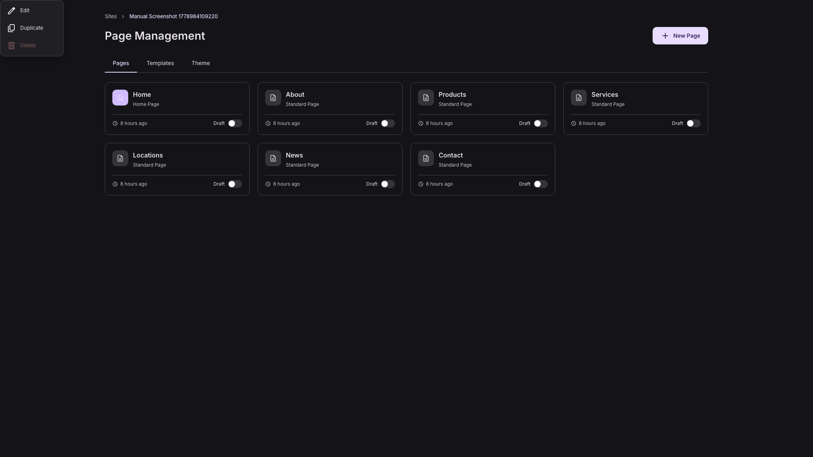
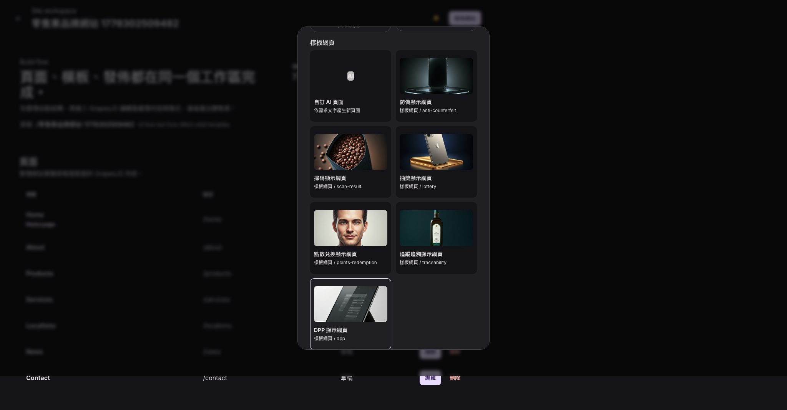
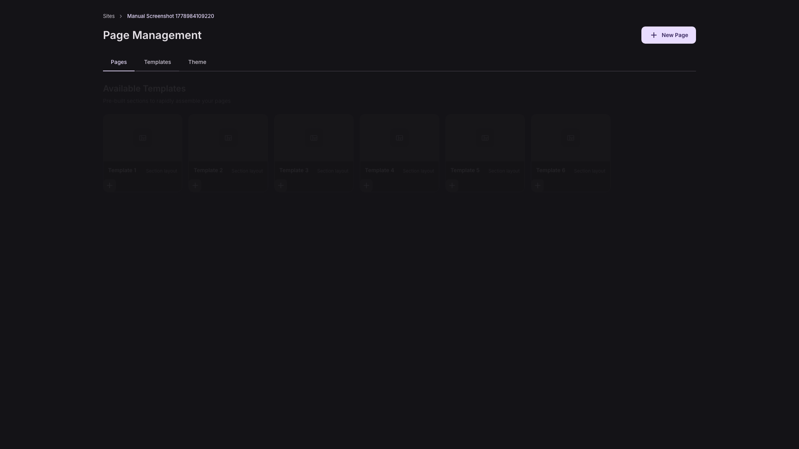
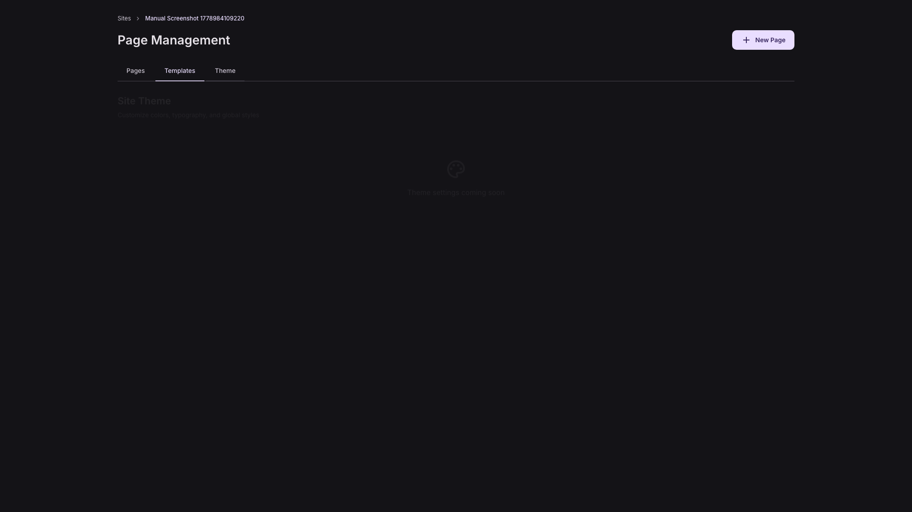

# Workspace 與頁面管理使用手冊

適用位置：`/sites/:siteId`  
驗證方式：E2E 建立樣板網站、Workspace 截圖、前端頁面管理實作

## 1. Workspace 功能定位

Workspace 是單一網站的管理中心。它位在 Dashboard 與 Editor 之間，用來管理網站頁面與進入編輯器。

你可以在 Workspace：

- 查看網站下的所有頁面。
- 建立新頁面。
- 開啟任一頁面進入 Editor。
- 切換頁面發佈狀態。
- 查看頁面樣板區與 Theme 區。
- 刪除非首頁頁面。

## 2. 頁面列表

`Pages` 分頁會顯示頁面卡片。

每張頁面卡片包含：

| 欄位 | 說明 |
|---|---|
| 頁面標題 | 例如 Home、Products、About。 |
| 頁面類型 | Home Page 或 Standard Page。 |
| 更新時間 | 例如 Just now、1 hour ago。 |
| 狀態 | Published 或 Draft。 |
| 發佈切換 | 卡片右下角的 toggle。 |

點擊頁面卡片會開啟 Editor。

## 3. 建立一般頁面

1. 點右上角 `New Page`。
2. 輸入 `Page Title`。
3. 可輸入 `URL Slug`，例如 `about-us`。
4. 按 `Create Page`。
5. 建立後會直接進入 Editor。

如果沒有填 slug，後端會依頁面標題產生或保留預設處理。

## 4. AI 產生頁面

在部分 Workspace 版本中，可使用 `AI 產生頁面` 或相關入口建立新頁面。

操作流程：

1. 開啟 AI page generator。
2. 輸入 `Page name`。
3. 選擇 `Page type`。
4. 選擇 `Page template`，或使用自訂 AI prompt。
5. 填寫 `Generation prompt`。
6. 選擇 `Style` 與 `Content length`。
7. 按 `Generate and open editor`。

如果選擇 Stitch 頁面模板，例如 DPP、防偽、溯源、抽獎、點數兌換，系統會套用對應模板產生頁面並開啟 Editor。

## 5. 頁面更多選單

頁面卡片右上角的更多選單提供：

| 動作 | 狀態 |
|---|---|
| Edit | 開啟該頁 Editor。 |
| Duplicate | 目前顯示 coming soon，尚未實作完整複製。 |
| Delete | 可刪除一般頁面；Home page 不能刪除。 |

刪除頁面前會出現瀏覽器確認視窗。

## 6. Templates 分頁

`Templates` 分頁目前顯示預建 section layout 的佔位卡片。

目前狀態：

- 可瀏覽模板卡片。
- 加號按鈕目前主要是 UI 佔位。
- 真正的區塊拖曳主要在 Editor 左側 `Blocks` 面板中進行。

## 7. Theme 分頁

`Theme` 分頁目前顯示 `Theme settings coming soon`。

目前狀態：

- 全站 Theme 設定尚未完整開放。
- 若要調整頁面色彩與字體，請進 Editor 的 `Global Styles` 或右側 `Styles` 面板。

## 8. 回到 Dashboard

Workspace 上方 breadcrumb 的 `Sites` 可回到 Dashboard。

如果正在 Editor 中，左側 rail 的 Workspace/Home 圖示或上方返回按鈕可回到 Workspace。
